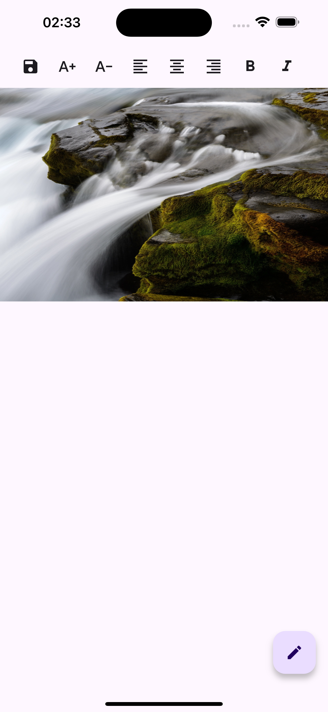
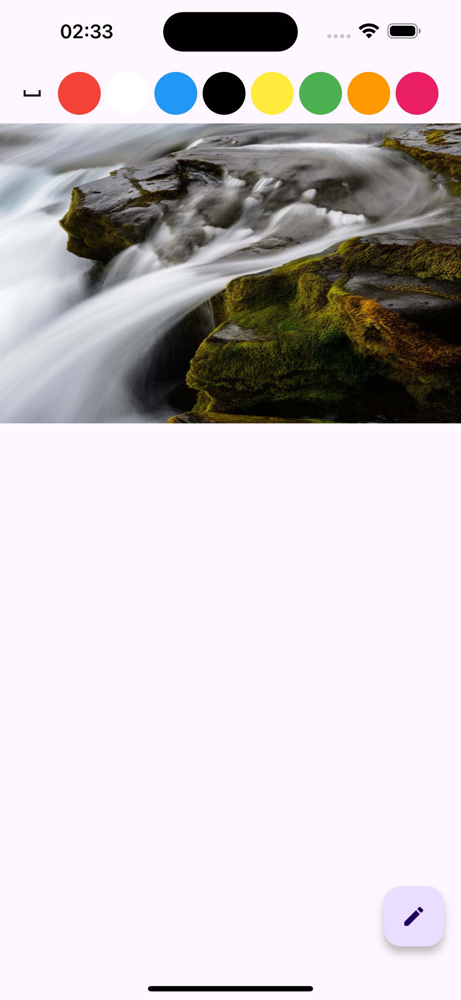
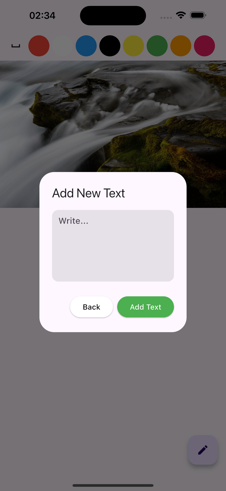

# Image Editor App

Image editor app have been created with some basic functionality of photo editing apps.
[reference link](https://www.youtube.com/watch?v=vzg6iNziiKw&list=PLlzmAWV2yTgBNJnVxlLiSrdHcM07T2Huo&index=2)

## Table of Contents

- [Features](#features)
- [Screenshots](#screenshots)
- [Videos](#videos)
- [Installation](#installation)
- [Packages used](#packages-used)

## Features

- Get image from gallery
- Place a text on the image
- Save image to gallery with text on it
- Increase/Decrease font size of the text
- Align(left, center, left) the text
- Bold/Italic the text
- Add lines to text
- Change the color of the text

## Screenshots

  
  
  

  

## Videos

[Video on YouTube](https://youtu.be/GWzdXhSA0_w)

## Installation

After cloning this repository go to `image-editor-app` folder. Then, follow the following steps:

- Change text inside Info.plist file for iphone photo library, camera, microphone, photo library add
  photo.
- lines: 50, 52, 54, 56.

## Packages used

- image_picker
- screenshot
- image_gallery_saver
- permission_handler
